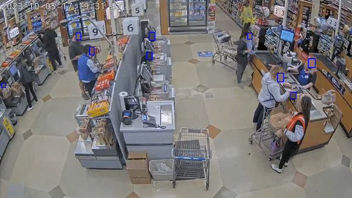

# Face Anonymisation

## Repository Link : https://github.com/ayush9818/Face_Anonymisation_Task/tree/main

This repository contains the scripy to process video stream, detect faces from the video and blur the faces to ananoymise them.

## Documentation

Leveraging the InsightFace Python library, we implemented the buffalo_l model, which corresponds to the RetinaFace model.

#### Key Characteristics of the RetinaFace Model

- **Unified Multi-task Framework**: RetinaFace operates through a single-phase deep learning mechanism, executing several tasks concurrently. This includes face identification, landmark pinpointing for faces, and the assessment of facial attributes. Designed with efficiency and precision in mind, this approach ensures streamlined operations.
- **Detection Using Anchor Boxes**: To identify faces of varying sizes and angles, the model harnesses predefined bounding boxes, known as anchor boxes, having distinct scales and dimensions. The learning process of the model refines these boxes, ensuring precise face localization in diverse images.
- **Superior Precision and Stability**: One of RetinaFace's hallmarks is its unparalleled accuracy in recognizing faces under diverse scenarios - be it fluctuating light conditions, different facial angles, or obstructions. The model's precision is boosted through the integration of progressive features and refinement techniques, establishing it as a reliable tool for face analysis endeavors.

## Run Locally

Clone the project

```bash
  git clone https://github.com/ayush9818/Face_Anonymisation_Task.git
```

Go to the project directory

```bash
  cd Face_Anonymisation_Task
```

Setup Virtual Environment and install dependencies

```bash
  python3 -m venv face_env
  source face_env/bin/activate
  pip install -r requirements.txt
```

Running the script

- To run without multi threading
```bash
  python face_detect_insightface.py --input-video <path to input video> \
  --output-video <path to output video> \
  --detection-threshold <threshold b/w 0 to 1>
```

- To run with multi threading
```bash
  python face_detect_insightface.py --input-video <path to input video> \
  --output-video <path to output video> \
  --detection-threshold <threshold b/w 0 to 1> \
  --num-workers <worker count usually b/w 1 to 10>
```


## Usage/Examples

- To run without multi threading
```bash
python face_detect_insightface.py \
    --input-video streams/sample.mp4 \
    --output-video streams/output_test.mp4 \
    --detection-threshold 0.25
```

- To run with multi threading
```bash
python face_detect_insightface_parallel.py \
    --input-video streams/sample.mp4 \
    --output-video streams/output_test.mp4 \
    --detection-threshold 0.25 \
    --num-workers 10
```


## Sample Output




## Acknowledgements

 - [Insightface](https://github.com/deepinsight/insightface/tree/master)
 - [RetinaFace](https://arxiv.org/abs/1905.00641)


